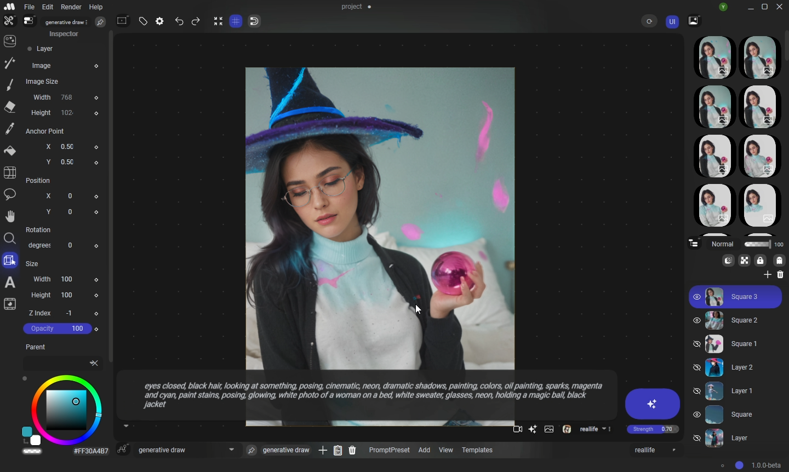
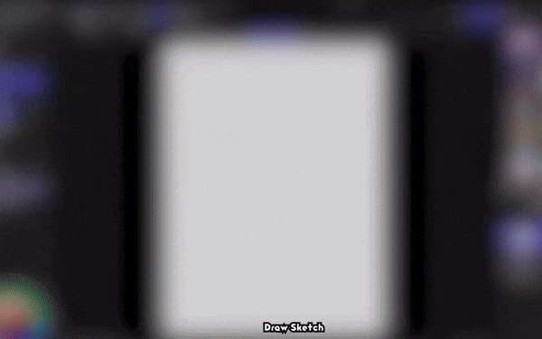
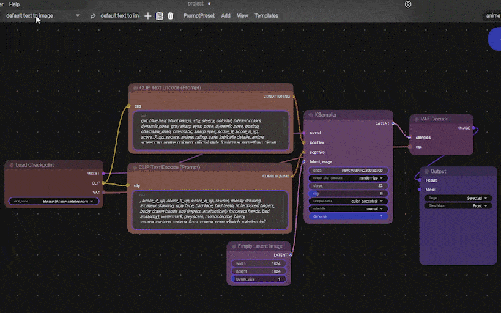
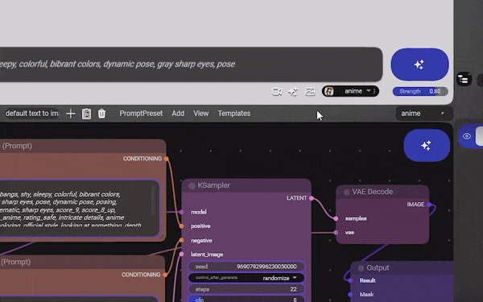
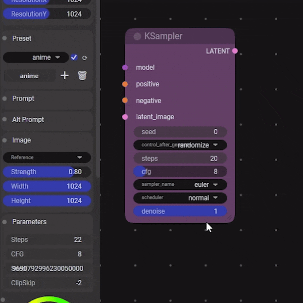
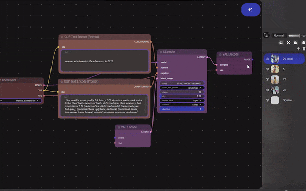
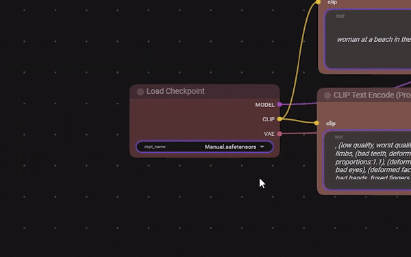

# Manual

Manual is an advanced ComfyUI Frontend. I developed it from scratch to be compatible with any AI that will be created in the future (and it's still a work in progress). I've written 100,000 lines of code for this project.

## 🚀 Platforms

-   Windows only (for now).

## ⚙️ Installation

1. **Download** [**Manual-1.1.0-portable.zip**](https://github.com/yowipr/Manual/releases/download/v1.1.0-beta/Manual-1.1.0-portable.zipp) 
 **or** [**Manual-1.1.0-setup.zip**](https://github.com/yowipr/Manual/releases/download/v1.1.0-beta/Manual-1.1.0-setup.zip) 
   or from **Civitai**: [https://civitai.com/models/644188/manual](https://civitai.com/models/644188/manual)
2. **Clone** the [**ComfyUI-Manual custom node**](https://github.com/yowipr/ComfyUI-Manual) (`git clone`) into the **ComfyUI\custom_nodes** folder of your ComfyUI.
3. **Copy and paste the ComfyUI folder path into Manual** by navigating to **Edit -> Preferences**.
4. In the **bottom right corner**, click the **circle**, choose **Open Local Server**, and wait until the server starts (the circle will turn blue).
5. In the **Nodes** workspace, click **Refresh** to load your nodes and models.
6. **Select the AI model** you want to use.
7. **Write a prompt, click generate**, and you're done. **Enjoy all the tools!**

 
# 🎨 Main Features

### 🖌️ User Interface
Designed to be friendly to traditional artists (now digital artists are traditionals? 🤔)

[Watch the full video on YouTube](https://www.youtube.com/watch?v=3NynPgEyLNA)

### 🔄 Multiple Workflows and Templates
Manual has Templates for workflow nodes and Prompt Styles.

Add, Duplicate, Save, Load

you can drop a .json file with your workflows made with ComfyUI, but for some reason you can't do it from Manual to ComfyUI, who knows

for exporting: File -> Export -> Export Prompt Preset (PromptPreset is a workflow node)

### ✍️ Prompt Styles
All workflow nodes are linked to a Prompt Style, even this can be deactivated in every workflow node and have their own Prompt Style.
Prompt Styles are useful for testing different text prompts or making characters

### 🎚️ Drivers
With Drivers you can link the fields to the Prompt Style or provide a lambda expression.

**Attach a Prompt Style to a workflow node automatically**: in the nav bar of Latent Nodes Editor -> PromptPreset -> Automatic Drivers

**Custom Drivers setup**: right click in a node field -> Edit Driver -> write Prompt Style property name (usually Manual recommends a name)

for an advanced driver, you can use "source." followed by the property name.

- example 1: Strength
- example 2: source.Strength / 2
- example 3: source.Strength + source.CFG

### 🔧 Manual Nodes
- Layer Node
- Output Node

 

### 🌟 More
Manual might contain things I don't even remember, a lot of easter eggs lol.

 

## Considerations

-   To make all the tools work, you'll need some additional custom nodes from ComfyUI:
    -   [ComfyUI Impact Pack](https://github.com/ltdrdata/ComfyUI-Impact-Pack)
    -   [ComfyUI Essentials](https://github.com/cubiq/ComfyUI_essentials)
    -   [ComfyUI ControlNet Aux](https://github.com/Fannovel16/comfyui_controlnet_aux)
- **To use the `generative draw sketch` workflow**, you need to install [ControlNet Sketch](https://huggingface.co/TencentARC/t2i-adapter-sketch-sdxl-1.0/resolve/main/diffusion_pytorch_model.safetensors?download=true) (place it inside **ComfyUI\models\controlnet**).
-   The tools in Manual by default work with Stable Diffusion 1.5; however, you can change it in Preferences -> Template Mode [SD15, SDXL, Flux] ,or modify the Templates in the folder Manual/Resources/Templates/PromptPresets
-   **Manual projects do not save generation history** (the editor on the right); always place your images in layers.
-   **Be CAREFUL with Save Projects**, Manual is still in **beta**.

## 📜 Licence

-   Free. Commercial use allowed. Enjoy it!
-   I am not responsible for what you generate with Manual.
-   Period.

## 🔮 What's Next

-   The software is in beta, so feedback is appreciated.
-   For suggestions or assistance, you can reach me on [**Discord**](https://discord.gg/msKBTgu8Ca).
-   Contributions are welcome if you're a programmer or have ideas.

## 🎯 Goals

-   Make AI accessible for everyone.
-   Establish AI as a standard tool for professional and monetizable artwork; like films, anime, etc.

:sparkles: _Made with love._ :sparkles:

[discord badge]: https://flat.badgen.net/discord/members/msKBTgu8Ca?icon=discord
[discord link]: https://discord.gg/msKBTgu8Ca
[github stars badge]: https://flat.badgen.net/github/stars/yowipr/Manual?icon=github
[github stars link]: https://github.com/yowipr/Manual/stargazers